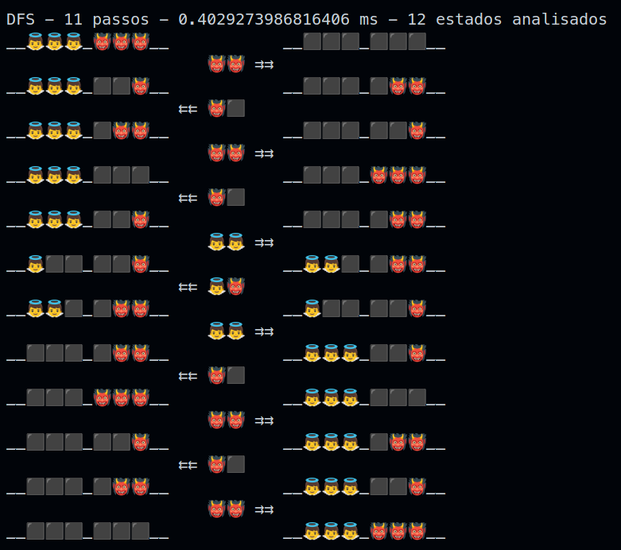
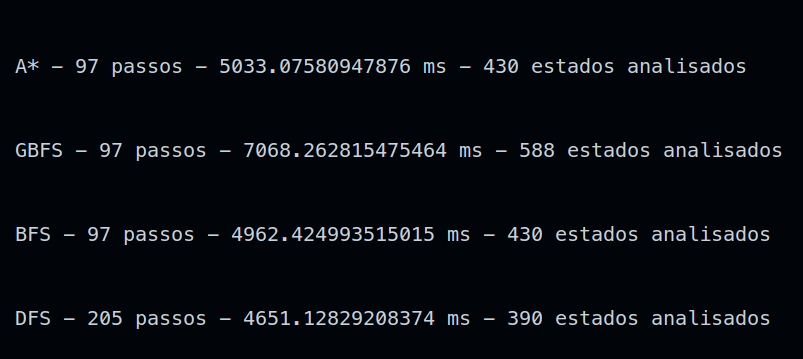

# PEL 202 - Tarefa 2 - Programa em Buscas

> Autor: Fábio Rossatti Gianzanti - Matrícula: 123107-5

## Proposta:

Faça um programa, utilizando qualquer linguagem de programação, que implemente os seguintes métodos de busca:

- Busca em Largura (BFS)
- Busca em Profundidade (DFS)
- Busca pela melhor escolha (Greedy Best-First Search)
- A\*

Utilize este programa para solucionar o Problema dos Missionários e Canibais.

O problema envolve três missionários e três canibais que desejam atravessar um rio, usando um barco que pode transportar no máximo duas pessoas de cada vez. No entanto, se em qualquer lado do riohouver mais canibais do que missionários, os canibais irão comer os missionários.

## Solução:

O programa foi desenvolvido em Python 3.10.6. Para executá-lo, basta executar o arquivo `MCSolution.py` no diretório raiz do projeto.

## Arquivos:

- `MCProblem.py`: Arquivo que contém as classes que representam o problema dos missionários e canibais.

  - `State`: Classe que representa um estado do problema, contendo a quantidade de missionários e canibais no estado atual, bem como a margem na qual o barco se encontra e a heurística do estado. Além disso, contém métodos para criar um hash para o estado e para comparar se 2 estados são iguais, de acordo com seu conteúdo.
  - `Action`: Classe que representa uma ação do problema, contendo a quantidade de missionários e canibais que devem ser transportados pelo barco, a direção para onde o barco de movimentará, o custo da ação. Também contém um método para criar um hash para a ação.
  - `Node`: Classe que representa um nó da árvore de busca, contendo o estado do nó, a ação que gerou o nó, o nó pai e o custo acumulado do nó. Também mantém uma propriedade para definir a prioridade daquele nó, quando usado em uma fila de prioridades.
  - `MCProblem`: Classe que representa o problema dos missionários e canibais, contendo as definições do tamanho de cada um dos grupos, a capacidade de transporte do barco, a margem inicial, os estados iniciais e finais e um cache para armazenar os cálculos de estados e ações. Possui métodos para gerar as ações possíveis a partir de um estado, para gerar os estados sucessores de um estado e para calcular a heurística de um estado. Também tem um método que permite a representação gráfica da solução do problema, a partir do caminho realizado na árvore de busca. Essa representação é feita utilizando apenas caracteres UNICODE e, dependendo do console utilizado, pode ser que não fique com um alinhamento correto.

- `MCSolution.py`: Arquivo principal do programa, contendo a implementação do algoritmo de busca e a solução do problema dos missionários e canibais. Caso nenhuma alteração tenha sido feita no código, apresenta a saída padrão, com a resolução do problema clássico (3 missionários, 3 canibais, 2 lugares no barco, margem inicial à esquerda) usando os 4 algoritmos disponíveis. Exibe também o tempo de execução de cada algoritmo e em quantos passos foi possível alcançar o estado final e quantos estados foram analisados para chegar a esse resultado, como mostrado na figura abaixo:
  <figure>
    
  </figure>

  - **Personalizando os testes**: Para tentar encontrar soluções para problemas com outras configurações, basta alterar as variáveis `groupSize` e `boatCapacity`, com os valores desejados e executar o programa novamente. A variável `showGraph` é um boleano que define se a solução gráfica será exibida ou não. Para selecionar quais algoritmos quer visualizar na solução apresentada, basta alterar a variável `algorithms` para uma lista contendo os nomes dos algoritmos desejados. Os nomes dos algoritmos disponíveis são:

    - `bfs`: Busca em Largura
    - `dfs`: Busca em Profundidade
    - `gbfs`: Busca pela melhor escolha
    - `a*`: A\*

  - Por exemplo, para encontrar uma solução para o problema com 100 missionários, 100 canibais, 7 lugares no barco, usando todos os algoritmos e sem exibir a solução gráfica, basta alterar as variáveis `groupSize` para `100`, `boatCapacity` para `7`, `showGraph` para `False` e executar o programa novamente. O resultado será semelhante ao mostrado na figura abaixo:
    <figure>
      
    </figure>
